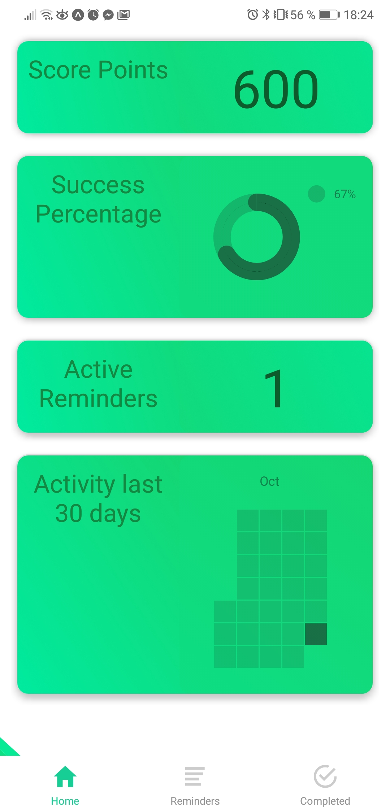
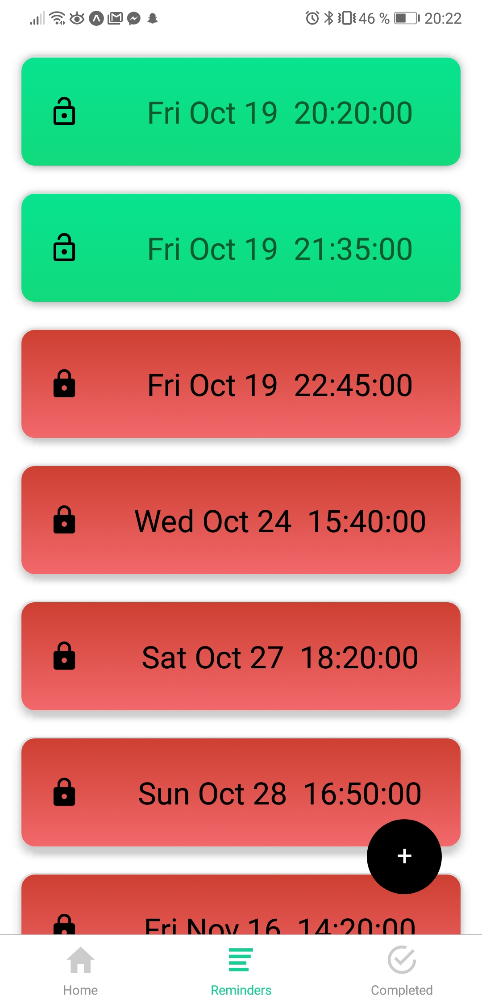
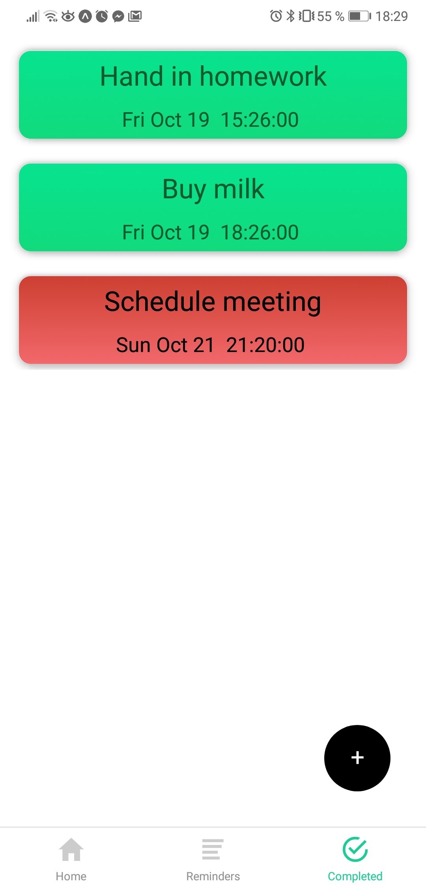

## Introduction
Many people struggle with their memory as technology take over their day to day lives. Our mission is to improve your memory by making a TODO-app that hides your reminders. Don't forget important reminders, let your app forget for you. By using incentives and known methods for improving ones memory, we aim to combine the effects of mind training apps with the practicality of TODO-apps. 

## Setup
### Prerequisites
* You will need the Expo app to run this project: https://play.google.com/store/apps/details?id=host.exp.exponent,          https://itunes.apple.com/us/app/expo-client/id982107779?mt=8

Go to the following link: https://expo.io/@skugge/it2810-webutvikling-h18-prosjekt-3-gruppe--57 
and scan the QR-code with the Expo app

Alternatively: 

1. Install expo-cli
```console
foo@bar:~$ npm install -g expo-cli
```
2. Clone the project
```console
foo@bar:~$ git clone https://github.com/IT2810/it2810-webutvikling-h18-prosjekt-3-gruppe--57.git
```
3. Run npm install (in project directory)
```console
foo@it2810-webutvikling-h18-prosjekt-3-gruppe--57:~$ npm install
```
4. Run expo-cli
```console
foo@it2810-webutvikling-h18-prosjekt-3-gruppe--57:~$ expo start
```
5. Scan QR code with the Expo app

## Permissions 
We require permissions for the following:

* Camera - For acceess to camera 
* Files - For saving images to device
* Notifications - For giving you notifications when reminder is unlocked 
* Location - For displaying location hint, and mapping completed reminders

## Usage 
The homescreen keeps you up to date on how well you're doing. 
It shows you a cummulative score, number of active reminders, success percentage, as well as monthly activity.

The reminder-tab displays all active reminders sorted by date. Unlocked reminders are green, locked reminders are red. 
Activating a locked reminder will result in a penalty. Pressing the button will open a modal for creating a new reminder.

The completed-tab shows all completed reminders, successful reminders are green, failed reminders are red. 
By pressing the button you will be able to see every reminder plotted on a map. 

<p float="left">
  
  
  
</p>

To create a reminder go to reminders-tab and press the black button. 
Then press the reminder-field and type what you want to remember. 
Press pick date, select a date from the calendar and time from the clock. 
(Optional) If you want a image hint, press 'Add image hint' and press the circle to take a picture. 
You can change reminder, date, and image as much as you want, when pressing save the latest values will be saved.


 
To check if you remember you reminder go to reminders-tab and press the reminder you want. 
If the reminder is locked an overlay will pop up, by continuing you will lose 500 points. 
Once inside, press the reminder-field and type in your guess. 
If you need help you can view a image-hint and/or a location-hint, both of these will affect your score. 
Check your guess by pressing 'check', incorrect attempts will affect your score. 


## Technology 
* AsyncStorage
  AsyncStorage is a persistent storage system in React Native that provide the ability to store data asynchronously.
  This means data can be recovered between sessions. We used an abstraction on top of asyncStorage(Storage.js) to put 
  all logic towards storage in one place. When the user starts the app for the first time a user-object is created,
  this contains a score, and arrays of reminder-objects. 
  
  ```JSON
   {
    "id": "9ef14208-3446-4fca-bbd9-d891b9b0c7aa",
    "score": 1000,
    "reminders": [ ],
    "successful": [ ],
    "failed": [ ],
   }
  ```
  
   Reminder-objects are created by the user. ```getItem``` and ```setItem``` are abstracted functions which are used
   by the other functions in ```components/Storage.js``` to store and retrieve these objects. The other functions simply
   manipulate the objects. 
   
   ```JSON 
    {
      "id": "42f8198b-56c0-4ded-90ac-e07b6b79f077",
      "reminder": "Buy milk",
      "attempts": 0,
      "date": "Fri Oct 19  14:30:00 ",
      "dateMilliseconds": 1539952200000,
      "img": "file:///storage/emulated/0/DCIM/fe110000-7ba2-470a-8ae2-2d2112c0b6b5.jpg",
      "location": {
          "latitude": 63.4154103,
          "latitudeDelta": 0.04,
          "longitude": 10.4047432,
          "longitudeDelta": 0.05,
      },
      "locked": false,
      "imgHint": false,
      "mapHint": false,
      "notification": null,
    }
  ```
  
* Expo 
  * Camera
  * ImageManipulator 
  * Notifications
  * Location
  * MapView
* react-native-svg-charts
* react-native-elements
* react-native-maps
* react-native-action-button
* react-native-textinput-effects
* react-native-modal-datetime-picker
* react-native-vector-icons/MaterialCommunityIcons

## Structure 
The application is split into three screens located in screens directory. These represent the main tabs. 
These screens make calls to components in components directory. 
Storage.js handles all communication with asyncStorage, if a component wants to fetch, set, or change items it has to do so through Storage.
Score.js includes logic related to user score. 
This includes incrementing attempts, keeping track of hints used and updating the actual score. 
Util.js is a general component for functionality that can be used in many different components like date formatting, object creation, and image manipulation.

## Testing 

## Known issues 
On some devices the camera will only display a black screen, a workaround is to go back and then open the camera again. 

## Sources
